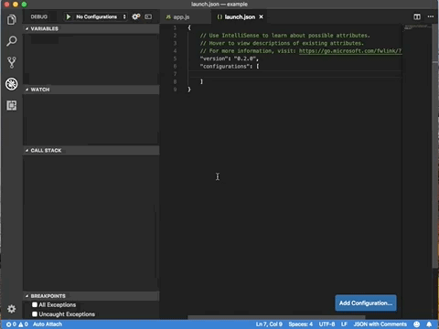

# Node Debugger with mixed Live and Time-Travel support

This debugger provides a launch configurations and support for mixing live and 
time-travel debugging in Node.js 10+. In addition to the Visual Studio Code 
debugger logic this extension provides:
1. [NodeChakraCore binaries](https://github.com/nodejs/node-chakracore) with 
time-travel debugging functionality.
2. Launch configuration for mixed live/time-travel debugging.

# Notes
1. The debugger always uses the extension provided NodeChakraCore binaries. If 
your application depends on a specific version of Node you may encounter 
unusual behavior.
2. Time-Travel mode is **not** enabled until synchronous module loading has 
completed and Node is running asynchronous event-loop code. 
3. A directory called `_ttd_log_` will be created in the project root to hold 
the time-travel trace files. You may want to add this to your `.gitignore`.

# Usage

## Initiating Time-Travel
The `TTD Enabled` launch configuration will launch the application in `live` 
debugging mode where you can debug just as with the regular Node debugger. 
However, if you click the `step back` button it will configure and launch 
an additional `reverse execution` debug target which allows you to step back 
and reverse continue in your debugger as shown here:

## Managing Live and Time-Travel Modes
The `reverse execution` mode can navigate the program execution from the point 
in time where it was launched back to the start of the recording (2-4 seconds 
prior). You can switch between `live` and `reverse` targets using the 
multi-target selector drop-down. When you are done with the `reverse` mode
you can simply stop it and, if desired later, spawn a new session from the 
`live` mode at any later point in time. 

## Adding a Launch Configuration
A launch configuration template providing combined live/step-back 
functionality is provided and can be added via the `Add Configuration` dialog 
as shown here:

## License

Copyright (c) Microsoft Corporation. All rights reserved.

Licensed under the [MIT](LICENSE.txt) License.
